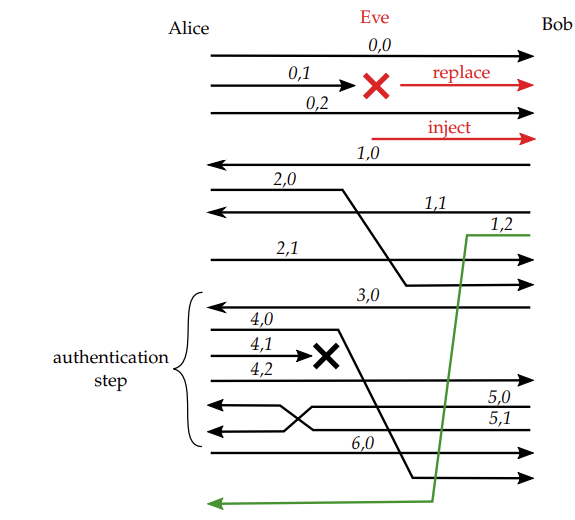
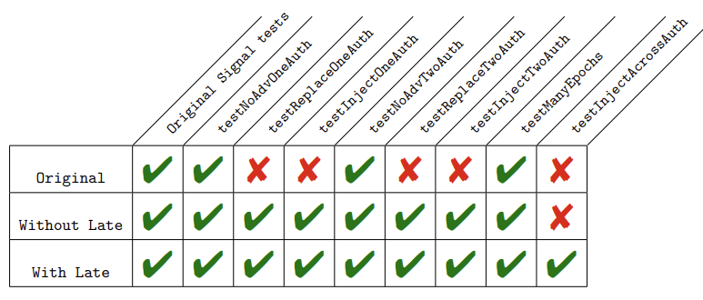

# Overview

This repository contains the implementation of the Authentication Steps protocol.
It extends the official Java implementation for the Signal application to provide a more complete post-compromise security property against active Man-in-the-Middle attackers.

## Tests

Several tests are performed, which vary according to:
- the number of authentication steps;
- the presence of out-of-order or dropped messages;
- the presence of an attacker.

There are several types of out-of-order messages. The type denoted as `simple` describes any message dropped or out-of-order, even messages during authentication steps. 
They can arrive in any possible order, but messages sent before an authentication step never arrive after it.
This is in contrast to `late` messages, which are out-of-order messages that can arrive even after an authentication step arrives. 

We also capture two types of attackers: `replace` and `inject`.
Attacker `replace` leaks the state of one party. When the party sends the next message, the attacker drops the message and replaces the ciphertext with a forged ciphertext, encrypting a different plaintext message.
On the other hand, attacker `inject` leaks the state of one party at the end of an epoch, and adds a new message at the end of the epoch.

| Test name | Authentication steps | Out-of-order | Attacker |
|-----------|----------------------|--------------|----------|
| testNoAdvOneAuth | 1 | Simple | None |
| testReplaceOneAuth | 1 | Simple | Replace |
| testInjectOneAuth | 1 | Simple | Inject |
| testNoAdvTwoAuth | 2 | Simple | None |
| testReplaceTwoAuth | 2 | Simple | Replace |
| testInjectTwoAuth | 2 | Simple | Inject |
| testManyEpochs | 150 | None | None |
| testInjectAcrossAuth | 2 | Late | Inject |


Different types of attacker

## Branches

- testing the original implementation can be done on branch `test0`;
- the implementation without late messages management can be found on branch `test1`;
- the full implementation can be found on branch `test2`;
- the `master` branch contains additionnaly the test with out-of-band checks.

### Running the tests

To run the tests, go to the branch you want to test and run the command:

```
./ gradlew clean test -- tests TestName
```

### Tests results

The following table lists the results of those tests:



## Benchmarking

To launch benchmarking tests, use:

```
./ gradlew clean test -- tests BenchmarkingTest
```

Then graphs can be drawn using the `graph.py` file.

